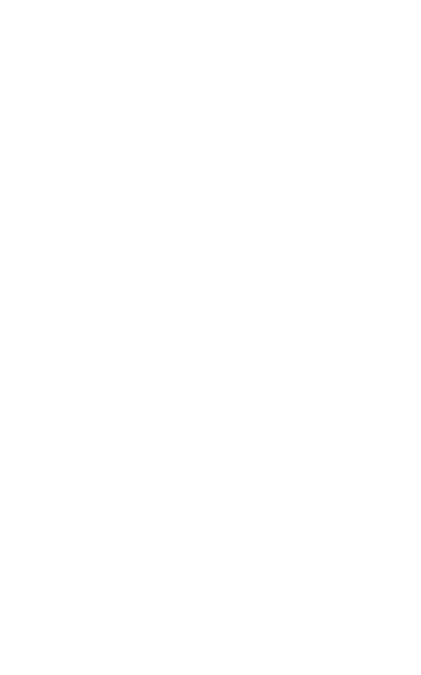

# itmo_opd_lab1
### 1. Создать приведенное в варианте дерево каталогов и файлов с содержимым. В качестве корня дерева использовать каталог `lab0` своего домашнего каталога. Для создания и навигации по дереву использовать команды: `mkdir, echo, cat, touch, ls, pwd, cd, more, cp, rm, rmdir, mv`.

### 2. Установить согласно заданию права на файлы и каталоги при помощи команды `chmod`, используя различные способы указания прав.

- baltoy3: владелец должен читать директорию и переходить в нее; группа-владелец должна читать, записывать директорию и переходить в нее; остальные пользователи должны читать, записывать директорию и переходить в нее
- mudkip: владелец должен читать и записывать файл; группа-владелец должна читать файл; остальные пользователи должны не иметь никаких прав
- axew: владелец должен не иметь никаких прав; группа-владелец должна читать и записывать файл; остальные пользователи должны не иметь никаких прав
- aggron: права 337
- exploud: -wx-wxr-x
- drilbur: владелец должен читать, записывать директорию и переходить в нее; группа-владелец должна читать и записывать директорию; остальные пользователи должны читать директорию
- magmar3: права 755
- honchkrow: владелец должен читать, записывать директорию и переходить в нее; группа-владелец должна записывать директорию и переходить в нее; остальные пользователи должны записывать директорию и переходить в нее
- finneon: ---r--rw-
- bidoof: права 004
- crobat: права 064
- oshawott3: владелец должен читать, записывать директорию и переходить в нее; группа-владелец должна читать, записывать директорию и переходить в нее; остальные пользователи должны читать, записывать директорию и переходить в нее
- hitmontop: rw--w----
- karrablast: r-xrwxrw-
- darmanitan: ---rw----
- rapidash4: rw--w-r--
- surskit2: r--r-----
- turtwig0: права 660

### 3. Скопировать часть дерева и создать ссылки внутри дерева согласно заданию при помощи команд `cp` и `ln`, а также комманды `cat` и перенаправления ввода-вывода.

- объеденить содержимое файлов lab0/magmar3/bidoof, lab0/baltoy3/axew, в новый файл lab0/surskit2_99
- скопировать содержимое файла rapidash4 в новый файл lab0/baltoy3/axewrapidash
- скопировать рекурсивно директорию baltoy3 в директорию lab0/baltoy3/exploud
- скопировать файл turtwig0 в директорию lab0/baltoy3/exploud
- cоздать символическую ссылку для файла turtwig0 с именем lab0/magmar3/crobatturtwig
- cоздать жесткую ссылку для файла turtwig0 с именем lab0/baltoy3/mudkipturtwig
- создать символическую ссылку c именем Copy_78 на директорию oshawott3 в каталоге lab0

### 4. Используя команды `cat, wc, ls, head, tail, echo, sort, grep` выполнить в соответствии с вариантом задания поиск и фильтрацию файлов, каталогов и содержащихся в них данных.

- Подсчитать количество символов содержимого файлов: mudkip, axew, finneon, bidoof, crobat, результат записать в файл в директории /tmp, ошибки доступа не подавлять и не перенаправлять
- Вывести четыре первых элемента рекурсивного списка имен и атрибутов файлов в директории lab0, список отсортировать по убыванию даты модификации файла, добавить вывод ошибок доступа в стандартный поток вывода
- Рекурсивно вывести содержимое файлов с номерами строк из директории lab0, имя которых начинается на 'm', строки отсортировать по имени z->a, подавить вывод ошибок доступа
- Вывести содержимое файлов: mudkip, axew, finneon, bidoof, crobat с номерами строк, исключить строки, содержащие "She", ошибки доступа не подавлять и не перенаправлять
- Вывести четыре последних элемента рекурсивного списка имен и атрибутов файлов в директории lab0, начинающихся на символ 'h', список отсортировать по возрастанию даты модификации файла, добавить вывод ошибок доступа в стандартный поток вывода
- Вывести список имен файлов в директории magmar3, список отсортировать по имени a->z, ошибки доступа не подавлять и не перенаправлять

### 5. Выполнить удаление файлов и каталогов при помощи команд `rm` и `rmdir` согласно варианту задания.

- Удалить файл turtwig0
- Удалить файл lab0/magmar3/finneon
- удалить символические ссылки lab0/magmar3/crobatturtw*
- удалить жесткие ссылки lab0/baltoy3/mudkipturtw*
- Удалить директорию magmar3
- Удалить директорию lab0/baltoy3/exploud
